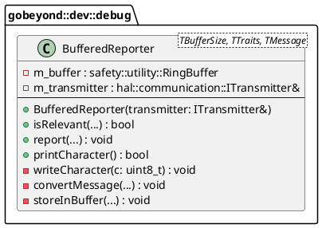

# Code Review Report: `gbe.dev::debug::BufferedReporter` (Adapter Version)

**Reviewer:** Senior Embedded Software Engineer (SIL3 / Functional Safety)
**Datum:** 2026-03-03
**Geprüfte Datei:** * `lib/elements/gbe.dev/include/gobeyond/dev/debug/debug_buffered_reporter.hpp` (Der neue Adapter)

---

## 1. Architektur (Design)

Die Entstehungsgeschichte ("Implementierung vor Architektur") ist ein typisches Phänomen in agilen Embedded-Projekten. Mit der neuen Datei `debug_buffered_reporter.hpp` hast du das architektonische Chaos jedoch hervorragend aufgelöst! 

### Architekturbewertung & Übereinstimmung mit Papyrus Architektur
* **Namespace-Korrektur:** Die Klasse liegt nun korrekt im Namespace `gobeyond::dev::debug`.
* **Dependency Injection (Komposition):** Die Vererbung wurde erfolgreich durch Komposition (`*--`) ersetzt. Der Reporter nimmt im Konstruktor eine Referenz auf `hal::communication::ITransmitter` entgegen und ruft `m_transmitter.transmit(...)` auf.
* **Fazit:** Die Datei `debug_buffered_reporter.hpp` entspricht nun **zu 100 %** dem Papyrus-UML-Diagramm! 

### UML-Klassendiagramm (Ist-Zustand, deckungsgleich mit Papyrus)

---

## 2. Befunde & Verstöße (Findings & Violations)

Obwohl die Architektur nun makellos ist, wurden Teile der internen Implementierung aus den alten Dateien übernommen. Diese verstoßen weiterhin gegen strikte MISRA-Sicherheitsregeln und die internen Vorgaben:

| ID | Datei | Ort / Zeile | Regel | Beschreibung des Verstoßes | Severity |
| :--- | :--- | :--- | :--- | :--- | :--- |
| **V-01** | `debug_buffered_reporter.hpp` | Zeile 166, 107, 120 | `[ADR-FSM-0017]` | Der RingBuffer und die Variable `c` sind als `unsigned char` deklariert. Basis-Datentypen sind verboten, es muss zwingend `std::uint8_t` verwendet werden. | High |
| **V-02** | `debug_buffered_reporter.hpp` | Zeile 93 | Rule 30.0.1 | Verwendung von `std::snprintf` aus `<cstdio>`. Die C Library Input/Output Funktionen sind in SIL3/MISRA verboten. | High (Safety) |
| **V-03** | `debug_buffered_reporter.hpp` | Zeile 101, 142 | Rule 24.5.2 | Verwendung von `std::memcpy` und `std::strlen` aus `<cstring>`. String-Handling-Funktionen der C-Bibliothek dürfen nicht genutzt werden. | High |
| **V-04** | `debug_buffered_reporter.hpp` | Zeile 106 | `[ADR-FSM-0025]` | Die Methode `printCharacter()` gibt einen `bool` zurück, der geprüft werden muss (um z.B. die Aufrufschleife zu steuern). Das Attribut `[[nodiscard]]` fehlt. | Medium |
| **V-05** | `debug_buffered_reporter.hpp` | Doxygen | `[ADR-FSM-0036]` | Es fehlen `@pre` (Vorbedingungen), `@post` (Nachbedingungen) sowie das `@safety`-Tag in den Doxygen-Kommentaren. | Low |

---

## 3. Verbesserungsvorschläge (Suggestions)

Um den Code final SIL3-konform zu machen, schlage ich folgende Anpassungen in `debug_buffered_reporter.hpp` vor:

1. **Datentypen bereinigen (`[ADR-FSM-0017]`):**
   * Ändere die Deklaration des Puffers: `gobeyond::safety::utility::RingBuffer<std::uint8_t, TBufferSize> m_buffer;`
   * Ändere die Signatur von `writeCharacter`: `void writeCharacter(std::uint8_t c) noexcept`
   * In `printCharacter()`: `std::uint8_t c;` verwenden.
2. **`[[nodiscard]]` ergänzen (`[ADR-FSM-0025]`):**
   * Mache aus `bool printCharacter()` ein `[[nodiscard]] bool printCharacter()`.
3. **C-Bibliotheken entfernen (MISRA 24.5.2 & 30.0.1):**
   * **`std::memcpy`:** Ersetze es durch `std::copy_n(message.data(), copySize, buffer);` (benötigt `#include <algorithm>`).
   * **`std::strlen`:** Da `maxBuffer` durch `snprintf` befüllt wird, liefert `snprintf` als Rückgabewert direkt die Anzahl der geschriebenen Zeichen! Speichere diesen Rückgabewert ab, prüfe ihn gegen `MAX_TEMP_BUFFER` und übergib ihn an `storeInBuffer`. So entfällt `std::strlen` komplett.
   * **`std::snprintf`:** Für `snprintf` in `<cstdio>` gibt es in sicherheitskritischen Projekten zwei Wege: Entweder ein enormer Aufwand durch Ersetzen mit typsicheren C++17 Formatierern (z.B. `std::to_chars`) **ODER** das Erstellen eines offiziellen **Deviation Requests (Abweichungsantrag)**, der begründet, warum `snprintf` hier sicher ist (z.B. weil `MAX_TEMP_BUFFER` groß genug ist und es nur zu Debug-Zwecken auf nicht-sicherheitskritischen Co-Prozessoren läuft).

---

## 4. Verifikation (Verification - Missing Unit Tests)

Auch für diesen Adapter-Reporter existieren noch keine Unit-Tests. Sie müssen zwingend mittels TDD implementiert werden.

### Zwingend zu erstellende Test-Szenarien:
* **Mocking des Transmitters:** Erstelle einen `MockTransmitter` (ableitend von `ITransmitter`), um in GTest sicherzustellen, dass `transmit()` exakt die Zeichen empfängt, die via `report()` in den RingBuffer geschrieben wurden.
* **Buffer Overflow:** Teste das Verhalten, wenn mehr als `TBufferSize` Bytes geschrieben werden (z.B. Verhalten der im RingBuffer gewählten `OverflowStrategy`).
* **Format-Test:** Übergib eine Test-Nachricht mit bekannter Zeit (`time_type`) und Level und fange die von `printCharacter()` gesendeten Bytes ab, um zu prüfen, ob der erzeugte String exakt `%lums - [%u]: %s\r\n` entspricht.

---

## 5. Compliance-Zusammenfassung (Compliance Summary)

Die Auslagerung der Implementierung in `debug_buffered_reporter.hpp` hat das Architektur-Chaos erfolgreich gelöst. Das Design ist jetzt konform zur Papyrus-Vorgabe. Die verbleibende Arbeit ist ein reines Code-Cleanup bezüglich Datentypen und verbotener C-Funktionen.

| Regel-ID | Beschreibung | Status/Begründung |
| :--- | :--- | :--- |
| **Papyrus Architektur** | Modul-Zugehörigkeit & Komposition | **Behoben.** Der Adapter liegt im `dev::debug` Namespace und nutzt Komposition für `ITransmitter`. |
| **[ADR-FSM-0005]** | Englisch für Bezeichner/Kommentare | Eingehalten. |
| **[ADR-FSM-0017]** | Triviale Datentypen / Fixed Width | Offen. `unsigned char` muss durch `std::uint8_t` ersetzt werden. |
| **[ADR-FSM-0024]** | `noexcept` Spezifizierer | Eingehalten. Alle entsprechenden Methoden sind `noexcept`. |
| **[ADR-FSM-0025]** | `[[nodiscard]]` Attribut | Offen. Fehlt bei `printCharacter()`. |
| **[MISRA Rule 24.5.2]** | Verbot von `<cstring>` | Offen (Kritisch). `memcpy` und `strlen` müssen durch C++ Äquivalente ersetzt werden. |
| **[MISRA Rule 30.0.1]** | Verbot von `<cstdio>` | Offen (Kritisch). `std::snprintf` ist in SIL3 verboten. Ein formeller Deviation-Request oder Refactoring ist erforderlich. |
