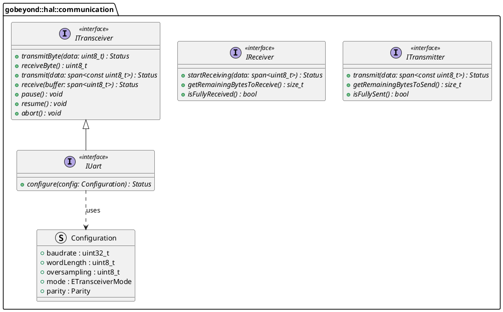

# Code Review Report: `gbe.hal::communication`

**Reviewer:** Senior Embedded Software Engineer (SIL3 / Functional Safety)
**Datum:** 2026-03-04
**Geprüfte Dateien:** * `ireceiver.hpp`, `itransmitter.hpp` (Asynchrone IPC-Interfaces)
* `itransceiver.hpp`, `iuart.hpp` (Synchron/Allgemeine Interfaces)
* `status.hpp`, `parity.hpp`, `transceiver-mode.hpp` (Typen)
* `span.hpp` (Utility)
* `i_concurrent_transceiver.hpp` (Legacy)
* *Architektur-Vorgaben (Papyrus PlantUMLs)*

---

## 1. Architektur (Design) & Abgleich mit Papyrus

Das Päckchen `communication` ist das Herzstück der Hardware-Abstraktion (HAL). Der Code spiegelt eine bemerkenswerte Evolution wider: Weg von monolithischen Legacy-Interfaces (`IConcurrentTransmitter`) hin zu feingranularen, sauberen Schnittstellen (`ITransmitter`, `IReceiver`).

### Architekturbewertung
* **Interface Segregation Principle (ISP):** Exzellent umgesetzt! Dass die Methode `transceive()` (gleichzeitiges Senden/Empfangen, typisch für SPI) bewusst aus `ITransceiver` weggelassen wurde, verhindert, dass asynchrone Schnittstellen wie UART Dummy-Implementierungen schreiben müssen.
* **Trennung von synchron/asynchron:** Das Papyrus-Modell trennt sauber zwischen den asynchronen Rollen (`ITransmitter` / `IReceiver` mit `isFullySent`) und dem blockierenden/allgemeinen `ITransceiver`. Der Code bildet das 1:1 ab.
* **Eigener `span`:** Da ihr C++17 nutzt (wo `std::span` erst ab C++20 verfügbar ist), ist der Eigenbau eines non-owning `span` architektonisch die exakt richtige Entscheidung für Pufferübergaben ohne Kopier-Overhead.

### UML-Klassendiagramm (Zusammenfassung der Ist-Architektur)


---

## 2. Befunde & Verstöße (Findings & Violations)

Das Design ist massiv, aber der Teufel steckt im Detail. Es gibt einige kritische Verstöße gegen die MISRA "Rule of Five" bei den virtuellen Klassen und einen architektonischen Logikfehler bei den Datentypen der `Configuration`.

| ID | Datei | Ort / Zeile | Regel | Beschreibung des Verstoßes | Severity |
| :--- | :--- | :--- | :--- | :--- | :--- |
| **V-01** | `Alle *.hpp` | Global | `[ADR-FSM-0005]` | Alle Doxygen- und Inline-Kommentare sind auf Deutsch. Die Sprachuntermenge fordert zwingend Englisch. | Medium |
| **V-02** | `iuart.hpp` | Zeile 42, 43 | `[ADR-FSM-0017]` | `baudrate` und `wordLength` sind als `std::size_t` deklariert. Die ADR besagt zwingend: "Der Datentyp `std::size_t` wird für Variablen verwendet, die die Größe eines Objektes beschreiben". Eine Baudrate ist *keine* Objektgröße. Hier muss ein Fixed-Width Integer verwendet werden. | High |
| **V-03** | `i*.hpp` | Klassendefinitionen | Rule 15.0.1 | Die Interfaces (`IReceiver`, `ITransmitter`, `ITransceiver`, `IUart`) besitzen einen virtuellen Destruktor, verbieten aber nicht explizit Copy- und Move-Semantik (`= delete`). Das ist für polymorphe Basisklassen ein Safety-Risiko (Objekt-Slicing). | High (Safety) |
| **V-04** | `span.hpp` | Implementierung | Architektur / C++ | Die `span`-Implementierung ist zu stark vereinfacht. Es fehlen die Iterator-Methoden (`begin()`, `end()`), was bedeutet, dass der `span` nicht in C++ Range-Based-For-Loops verwendet werden kann (welche durch Rule 9.5.1 empfohlen werden). | Medium |
| **V-05** | `Alle *.hpp` | Doxygen | `[ADR-FSM-0036]` | Bei nahezu allen virtuellen Methoden fehlen die zwingend geforderten `@pre`, `@post` und `@safety` Tags in der Doxygen-Dokumentation. | Low |

---

## 3. Verbesserungsvorschläge (Suggestions)

Hier sind die konkreten Handlungsschritte, um die Interfaces auf 100% SIL3- und C++17-Niveau zu bringen:

### 1. Datentypen in `iuart.hpp` korrigieren (V-02)
Ändere die Struktur `Configuration` so, dass fachlich korrekte Datentypen genutzt werden:
```cpp
struct Configuration {
    std::uint32_t baudrate = 9600U;        // uint32_t ist perfekt für bis zu 4 MBit/s
    std::uint8_t wordLength = 8U;          // uint8_t reicht für 8 oder 9 Bit
    std::uint8_t oversampling = 16U;
    ETransceiverMode mode = ETransceiverMode::Transceiver;
    Parity parity = Parity::None;
    // ... Konstruktoren entsprechend anpassen ...
};
```

### 2. Polymorphe Basisklassen abdichten (V-03)
Füge in **jedem** Interface (`ITransmitter`, `IReceiver`, `ITransceiver`, `IUart`) direkt nach dem virtuellen Destruktor Folgendes ein:
```cpp
virtual ~IReceiver() = default;

// Rule of Five: Make base class unmovable (MISRA Rule 15.0.1)
IReceiver(const IReceiver&) = delete;
IReceiver& operator=(const IReceiver&) = delete;
IReceiver(IReceiver&&) = delete;
IReceiver& operator=(IReceiver&&) = delete;
```

### 3. Den C++17 `span` nutzbar machen (V-04)
Auf deine explizite Bitte hin, den `span.hpp` zu prüfen: Um ihn C++-idiomatisch nutzbar zu machen, musst du lediglich Pointer-Rückgaben für Iteratoren ergänzen. Füge in `class span` ein:
```cpp
[[nodiscard]] constexpr T* begin() const noexcept { return m_data; }
[[nodiscard]] constexpr T* end() const noexcept { return m_data + m_size; }
```
Damit kann die Applikation später Konstrukte wie `for(auto byte : rxSpan)` nutzen!

### 4. Englisch & Doxygen (V-01, V-05)
Übersetze die Kommentare und ergänze die Safety-Garantien.
*Beispiel für `startReceiving`:*
* `@pre Hardware must be configured and not currently receiving.`
* `@post DMA transfer is initialized in the background.`
* `@safety Non-blocking call, O(1) execution time.`

---

## 4. Verifikation (Missing Unit Tests)

Da dies reine Interfaces sind, gibt es keinen direkten Ausführungscode zu testen. Gemäß `[ADR-FSM-0034]` (TDD) müssen für das `communication`-Päckchen jedoch **GoogleMock (gmock) Klassen** generiert werden.

**To-Do für die Tests:**
Erstelle einen Header `mock_communication.hpp` im Test-Ordner:
```cpp
class MockTransmitter : public gobeyond::hal::communication::ITransmitter {
public:
    MOCK_METHOD(Status, transmit, (span<const std::uint8_t>), (noexcept, override));
    MOCK_METHOD(std::size_t, getRemainingBytesToSend, (), (const, noexcept, override));
    MOCK_METHOD(bool, isFullySent, (), (const, noexcept, override));
};
```
Diese Mocks sind zwingend erforderlich, um später die Applikationsebene (wie den `BufferedReporter`) gegen diese Hardware-Verträge testen zu können.

---

## 5. Compliance-Zusammenfassung (Compliance Summary)

Die Kommunikations-Architektur ist sehr robust. Sie trennt sauber zwischen zustandsbehafteten synchronen Transfers und non-blocking DMA-Zugriffen. Mit der Behebung der MISRA `Rule of Five` für Interfaces und der Datentyp-Korrektur in der Konfiguration ist dieses Päckchen bereit für die Hardware-Implementierung.

| Regel-ID | Beschreibung | Status/Begründung |
| :--- | :--- | :--- |
| **Papyrus Architektur** | UML Abdeckung | Exzellent. Die Trennung in `IReceiver`/`ITransmitter` und `ITransceiver` ist 1:1 umgesetzt. |
| **[ADR-FSM-0005]** | Englisch für Bezeichner/Kommentare | Offen. Alles ist aktuell auf Deutsch. |
| **[ADR-FSM-0017]** | Fixed Width Integers | Offen. `baudrate` und `wordLength` verstoßen durch Nutzung von `size_t` gegen die Definition. |
| **[ADR-FSM-0035]** | `struct` vs. `class` | Eingehalten. `Configuration` ist ein sauberes POD-Struct. Interfaces sind Klassen. |
| **[ADR-FSM-0036]** | Doxygen Dokumentation | Offen. `@pre`, `@post` und `@safety` müssen ergänzt werden. |
| **[MISRA Rule 11.6.1]** | Struct Initialisierung | Eingehalten. `Configuration` initialisiert alle Member. |
| **[MISRA Rule 15.0.1]** | Unmovable Base Class | Offen (Kritisch). In allen Interfaces müssen Copy/Move-Konstruktoren mit `= delete` verboten werden. |
