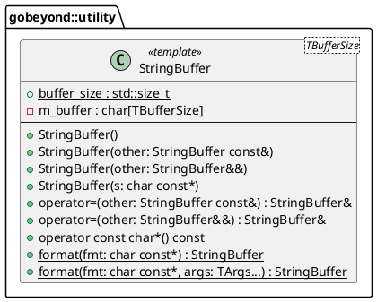

# Code Review Report: `gbe.utility::StringBuffer`

**Reviewer:** Senior Embedded Software Engineer (SIL3 / Functional Safety)
**Datum:** 2026-03-03
**Geprüfte Dateien:** * `lib/elements/gbe.utility/include/gobeyond/utility/string_buffer.hpp`
* `tests/string_buffer.cpp` *(Nicht vorhanden)*

---

## 1. Architektur (Design)

Die `StringBuffer`-Komponente stellt einen statisch allokierten (Stack/BSS) Speicherbereich zur Verfügung, um Zeichenketten zu formatieren und zu halten. 

### Architekturbewertung
* **Safety First (No Heap):** Die Entscheidung, den Puffer über das Template-Argument `TBufferSize` statisch zu definieren, ist für ein SIL3-System hervorragend. Es verhindert dynamische Speicherzuweisungen (`new`/`malloc`) komplett.
* **C-Library-Abhängigkeiten:** Die Klasse baut stark auf C-Bibliotheken (`<cstring>`, `<cstdio>`) auf. Dies steht in einem harten Konflikt zu modernen C++ Safety-Standards (MISRA), da C-String-Funktionen und `snprintf` keine Typsicherheit auf C++-Ebene bieten und häufig zu *Undefined Behavior* führen.

### UML-Klassendiagramm

---

## 2. Befunde & Verstöße (Findings & Violations)

Bei der Code-Analyse wurden kritische SIL3/MISRA-Verstöße im Bereich Speichermanagement und C-Bibliotheken festgestellt:

| ID | Datei | Ort / Zeile | Regel | Beschreibung des Verstoßes | Severity |
| :--- | :--- | :--- | :--- | :--- | :--- |
| **V-01** | `string_buffer.hpp` | Zeile 1 | `[ADR-FSM-0006]`, `[ADR-FSM-0007]` | `#pragma once` wird verwendet, aber der Include-Guard `#ifndef GBE_UTILITY_STRING_BUFFER_HPP` fehlt als Fallback. | High |
| **V-02** | `string_buffer.hpp` | Zeile 45, 60, 94, 114 | Rule 24.5.2 | Die C++ Standard Library Funktion `std::memcpy` aus `<cstring>` darf nicht verwendet werden. | High |
| **V-03** | `string_buffer.hpp` | Zeile 81, 154, 175 | Rule 30.0.1 | Die C Library Input/Output Funktionen dürfen nicht genutzt werden (hier: `std::snprintf` aus `<cstdio>`). | High |
| **V-04** | `string_buffer.hpp` | Zeile 92, 112 | Dir 15.8.1 | Benutzerdefinierte Copy- und Move-Assignment Operatoren müssen Selbstzuweisung (Self-Assignment) sicher handhaben. Ein Check à la `if (this == &other)` fehlt. | High |
| **V-05** | `string_buffer.hpp` | Zeile 92, 112 | Rule 15.0.2 | Zuweisungsoperatoren (`operator=`) sollten ref-qualifiziert sein (mit `&`), damit keine Zuweisungen an temporäre R-Values stattfinden. | Low |
| **V-06** | `string_buffer.hpp` | Zeile 75, 92 | `[ADR-FSM-0024]` | Die Member-Funktionen (insbesondere der Konstruktor aus `const char*` und der Copy-Assignment Operator) sind nicht als `noexcept` deklariert. | Medium |
| **V-07** | `string_buffer.hpp` | Zeile 19 | `[ADR-FSM-0013]` | Es fehlt ein `static_assert`, das sicherstellt, dass `TBufferSize > 0` ist. Arrays der Länge 0 führen in C++ zu *Undefined Behavior*. | Medium |
| **V-08** | `string_buffer.hpp` | Doxygen | `[ADR-FSM-0036]` | Das für die Safety-Analyse zwingend notwendige `@safety`-Tag sowie `@pre`/`@post` bei Funktionen fehlt in der Doxygen-Dokumentation. | Low |

---

## 3. Verbesserungsvorschläge (Suggestions)

1. **Include Guards:** Ergänze die `#ifndef GBE_UTILITY_STRING_BUFFER_HPP` Makros wie in `BitMask`.
2. **`static_assert` für Puffergröße:** Füge in der Klasse hinzu: `static_assert(TBufferSize > 0, "Buffer size must be greater than 0");`
3. **Ersatz für `<cstring>` (Rule 24.5.2):** Ersetze `std::memcpy` durch `std::copy_n` (aus `<algorithm>`) oder `std::char_traits<char>::copy` (aus `<string>`). Ersetze `std::memset` durch `std::fill_n`.
   *Beispiel:* `std::copy_n(other.m_buffer, buffer_size, m_buffer);`
4. **Behebung der Assignment-Verstöße:**
   Die Signatur muss lauten: `inline StringBuffer& operator=(const StringBuffer& other) & noexcept`.
   Die Implementierung muss mit `if (this == &other) { return *this; }` beginnen, um Rule 8.18.1 (Verbot von Overlapping Memory Copies) in Kombination mit Dir 15.8.1 abzufangen.
5. **Noexcept Qualifier:** Alle Funktionen, die keine Exceptions werfen (und laut Architektur gibt es keine Exceptions), müssen konsequent mit `noexcept` markiert werden.
6. **Problem `snprintf` (Rule 30.0.1):** Dieses Problem ist tiefgreifend. `<cstdio>` Funktionen sind laut MISRA strikt verboten. Wenn `snprintf` für das Projekt unabdingbar ist, muss zwingend ein dokumentierter **Deviation Request (Abweichungsantrag)** für Rule 30.0.1 erstellt werden. Alternativ sollten C++17 Funktionen wie `std::to_chars` genutzt werden, was aber den Variadic-Template Formatter (`format(fmt, args...)`) in der jetzigen Form unmöglich macht.

---

## 4. Verifikation (Verification - Missing Unit Tests)

Aktuell existieren **keine Unit-Tests** für diese Klasse. Gemäß `[ADR-FSM-0034]` und `[ADR-FSM-0038]` müssen diese per TDD in Google Test (GTest) erstellt werden.

### Zwingend zu erstellende Test-Szenarien:
* **Grenzwerte (Boundary values):**
  * Puffer-Überlauf (Overrun): Was passiert, wenn der zu formatierende String größer als `TBufferSize` ist? `snprintf` schneidet ihn ab, der Test muss sicherstellen, dass die Terminierung mit `\0` immer garantiert ist.
  * Puffer-Unterlauf: Initialisierung mit `nullptr` (wird in Zeile 77 abgefangen, muss getestet werden).
* **Positive Szenarien:**
  * Korrekte Formatierung von Integern und Strings.
  * Verhalten des Copy-Konstruktors und Move-Konstruktors (Wird der Quell-Puffer beim Move wirklich geleert?).
* **Self-Assignment:**
  * Zuweisung eines Buffers an sich selbst (`buffer = buffer;`). Darf nicht zum Absturz oder Datenverlust führen.
* **Compile-Time Checks:**
  * Prüfen, dass `StringBuffer<0>` nicht kompiliert (sofern das `static_assert` eingebaut wird).

---

## 5. Compliance-Zusammenfassung (Compliance Summary)

Die Klasse ist ein guter Ansatz für dynamikfreien Speicher, bricht aber grundlegende MISRA-Regeln im Bereich der C-Standardbibliotheken und der Implementierung von *Special Member Functions* (Rule 15.0.2 / Dir 15.8.1).

| Regel-ID | Beschreibung | Status/Begründung |
| :--- | :--- | :--- |
| **[ADR-FSM-0006/0007]** | Include Guards + `#pragma once` | Offen. Es fehlen `#ifndef`/`#define` Makros um den Dateiinhalt. |
| **[ADR-FSM-0013]** | Nutzung von `static_assert` | Offen. Sicherstellung, dass `TBufferSize > 0`. |
| **[ADR-FSM-0024]** | `noexcept` Spezifizierer | Offen. Fehlt u.a. beim Konstruktor und beim Copy Assignment. |
| **[ADR-FSM-0036]** | Doxygen Dokumentation (`@safety`) | Offen. Die Safety-Garantien fehlen im Kommentarblock. |
| **[MISRA Rule 15.0.2]** | Signatur Copy/Move Assignment | Offen. Es fehlt der `&` L-Value Qualifier auf den Operatoren. |
| **[MISRA Dir 15.8.1]** | Self-Assignment | Offen. Es gibt keine Prüfung auf `this == &other`. |
| **[MISRA Rule 24.5.2]** | Verbot von `<cstring>` `memcpy`/`memset`| Offen. Nutzung von `std::memcpy` muss durch `std::copy_n` o.ä. ersetzt werden. |
| **[MISRA Rule 30.0.1]** | Verbot von `<cstdio>` | Offen (Kritisch). Die Nutzung von `std::snprintf` ist verboten. Hier ist entweder ein Refactoring oder ein formaler Deviation-Request notwendig. |
