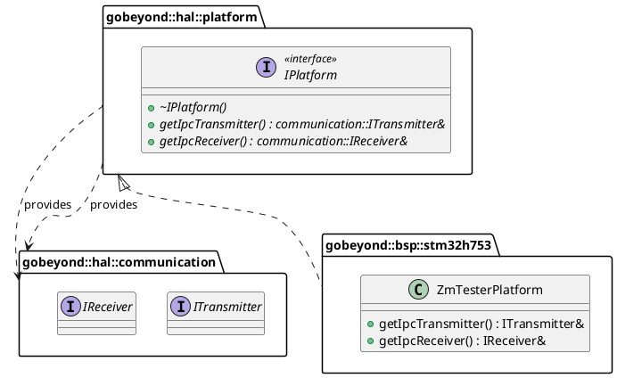

# Code Review Report: `gbe.hal::platform::IPlatform`

**Reviewer:** Senior Embedded Software Engineer (SIL3 / Functional Safety)
**Datum:** 2026-03-03
**Geprüfte Dateien:** * `lib/elements/gbe.hal/include/gobeyond/hal/platform/iplatform.hpp`
* `tests/test-zm-tester-platform.cpp`

---

## 1. Architektur (Design)

Die `IPlatform`-Schnittstelle definiert das abstrakte Hardware-Abstraktions-Layer (HAL) für die Anwendung. Anstatt dass die Applikation konkrete Treiber instanziiert, fordert sie über dieses Interface die benötigten Endpunkte (`ITransmitter`, `IReceiver`) an. 

### Architekturbewertung & Übereinstimmung mit Papyrus Architektur
* **Dependency Injection & Entkopplung:** Sehr starkes Design. Die Anwendungsebene kennt nur dieses Interface und holt sich darüber die Kommunikationsrollen. Das entspricht exakt den Anforderungen an eine testbare, lose gekoppelte Architektur.
* **Lebensdauer (Lifetimes):** Die Rückgabe als Referenzen (`&`) anstelle von Pointern impliziert, dass die Plattform (und damit die Hardware-Ressourcen) die gesamte Lebensdauer der Anwendung über existieren. Das ist für Embedded/SIL3 Best Practice (Vermeidung von dangling Pointern).

### UML-Klassendiagramm


---

## 2. Befunde & Verstöße (Findings & Violations)

Der Code ist extrem kompakt und nah am Optimum. Bei genauer Prüfung der SIL3/MISRA-Regeln zeigen sich jedoch folgende Abweichungen, insbesondere im Bereich der `Sprachuntermenge` und der *Rule of Five*:

| ID | Datei | Ort / Zeile | Regel | Beschreibung des Verstoßes | Severity |
| :--- | :--- | :--- | :--- | :--- | :--- |
| **V-01** | `iplatform.hpp` | Global | `[ADR-FSM-0005]` | Alle Doxygen- und Inline-Kommentare sind auf Deutsch formuliert ("Liefert den IPC-Transmitter..."). Die ADR fordert zwingend Englisch für Quelltext und Dokumentation. | Medium |
| **V-02** | `iplatform.hpp` | Zeile 35 | Rule 15.0.1 | Die Klasse hat einen `public virtual` Destruktor, was für Basisklassen gut ist. MISRA fordert jedoch zwingend, dass solche Klassen **"unmovable"** gemacht werden, um Objekt-Slicing zu verhindern. Copy- und Move-Konstruktoren sowie Zuweisungsoperatoren müssen explizit mit `= delete` gelöscht werden. | High |
| **V-03** | `iplatform.hpp` | Zeile 42, 53 | `[ADR-FSM-0036]` | In der Doxygen-Dokumentation der virtuellen Methoden fehlen die zwingend geforderten Tags `@pre` (Vorbedingungen), `@post` (Nachbedingungen) sowie das `@safety`-Tag. | Low |
| **V-04** | `test-zm-tester...` | Zeile 70, 71 | `[ADR-FSM-0017]` | Im Testcode (innerhalb des `extern "C"` Blocks) wird `uint8_t` und `uint16_t` ohne den `std::` Namespace verwendet. Dies ist in C++ Code verboten. *(Ausnahme: Wenn der vom Hersteller gelieferte HAL-Header dies durch C-Kompatibilität erzwingt, kann dies toleriert werden).* | Low |

---

## 3. Verbesserungsvorschläge (Suggestions)

1. **Sprache anpassen (`[ADR-FSM-0005]`):**
   Übersetze alle Kommentare ins Englische. (z.B. `@brief Platform interface for IPC endpoints.`).
2. **Ergänzung der Doxygen-Tags (`[ADR-FSM-0036]`):**
   Beispiel für `getIpcTransmitter()`:
   * `@pre The platform hardware must be fully initialized.`
   * `@post Returns a valid, long-lived reference to the transmitter.`
   * `@safety Constant time execution (O(1)), returns reference to statically allocated hardware wrapper.`
3. **Objekt-Slicing verhindern (MISRA Rule 15.0.1):**
   Füge der Klasse die Löschung der Copy/Move Operationen hinzu, um sie formal als *unmovable base class* abzusichern:
   ```cpp
   IPlatform(const IPlatform&) = delete;
   IPlatform& operator=(const IPlatform&) = delete;
   IPlatform(IPlatform&&) = delete;
   IPlatform& operator=(IPlatform&&) = delete;
   ```

---

## 4. Verifikation (Verification - `test-zm-tester-platform.cpp`)

Der mitgelieferte Test verifiziert nicht das Interface selbst (da abstrakt), sondern die korrekte Bindung in der konkreten Implementierung `ZmTesterPlatform`. Das ist ein hervorragendes Beispiel für Architektur-Tests!

### Positive Befunde
* **Contract-Testing:** Es wird sehr gut geprüft, ob die aufgerufenen Interface-Methoden in der konkreten Klasse auf dieselbe Hardware-Instanz (`Stm32UartDma`) zeigen.
* **100% Coverage:** Die Methoden werden alle durchlaufen.

### Safety-Anmerkung zum Testcode
Der Test nutzt `dynamic_cast<Stm32UartDma*>(&tx);` (Zeile 79). In sicherheitskritischer Produktions-Firmware (SIL3) ist RTTI (Run-Time Type Information) und damit `dynamic_cast` meist per Compiler-Flag (`-fno-rtti`) deaktiviert, da die Ausführungszeit nicht deterministisch ist. **Für Unit-Tests (Host-Umgebung) ist dies jedoch völlig legitim und eine sehr gute Methode**, um die Architekturverdrahtung zu prüfen!

---

## 5. Compliance-Zusammenfassung (Compliance Summary)

Das Interface `IPlatform` bildet eine exzellente, saubere Schnittstelle zwischen Logik und Hardware. Die Anpassungen sind primär formeller Natur (Sprache) sowie das Schließen einer kleinen Lücke bezüglich der C++ *Rule of Five*.

| Regel-ID | Beschreibung | Status/Begründung |
| :--- | :--- | :--- |
| **Papyrus Architektur** | Entkopplung von HAL | Eingehalten. Dient als zentrale Abstraktionsschicht. |
| **[ADR-FSM-0005]** | Englisch für Bezeichner/Kommentare | Offen. Doxygen ist aktuell auf Deutsch. |
| **[ADR-FSM-0006/0007]** | Include Guards | Eingehalten. `GBE_HAL_PLATFORM_IPLATFORM_HPP` ist korrekt. |
| **[ADR-FSM-0024]** | `noexcept` Spezifizierer | Eingehalten. Methoden sind `noexcept`. |
| **[ADR-FSM-0025]** | `[[nodiscard]]` Attribut | Eingehalten. Rückgaben der Interface-Methoden dürfen nicht ignoriert werden. |
| **[ADR-FSM-0036]** | Doxygen Dokumentation | Offen. `@pre`, `@post` und `@safety` müssen ergänzt werden. |
| **[MISRA Rule 15.0.1]** | Unmovable Base Class | Offen. Copy- und Move-Konstruktoren müssen mit `= delete` gelöscht werden, um Slicing zu verhindern. |
