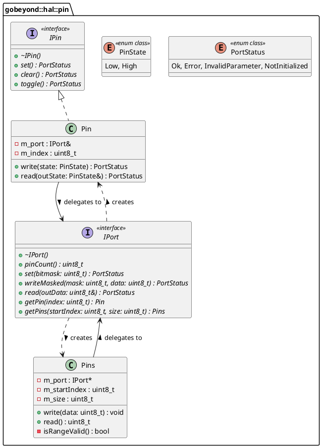

# Code Review Report: `gbe.hal::pin` (GPIO/Port Abstraktion)

**Reviewer:** Senior Embedded Software Engineer (SIL3 / Functional Safety)
**Datum:** 2026-03-03
**Geprüfte Dateien:** * `hal-types.hpp`
* `ipin.hpp`
* `iport.hpp`
* `pin.hpp` & `pin-impl.hpp`
* `pins.hpp` & `pins-impl.hpp`
* `tests/test-stm32-gpio-port.cpp`

---

## 1. Architektur (Design)

Das Paket `gbe.hal::pin` bietet eine extrem saubere, hardwareunabhängige Abstraktion für GPIO-Ports und -Pins. 
Besonders hervorzuheben ist die Lösung der zirkulären Abhängigkeiten ohne Nutzung des Heaps (dynamische Speicherverwaltung): Die Factory-Methoden `IPort::getPin` und `IPort::getPins` geben die Objekte typsicher *by-value* zurück. Das inkludieren der `-impl.hpp` Dateien am Ende des Headers ist ein bekanntes und im Embedded-Umfeld etabliertes Pattern, um Performance (Inlining) und Stack-basierte Allokationen zu vereinen.

### Architekturbewertung & Übereinstimmung mit Papyrus
* **Abstraktion (IPin / IPort):** Saubere Trennung von Interface und Implementierung (`[ADR-FSM-0035]`).
* **Dependency Injection:** `Pin` und `Pins` delegieren alle atomaren Lese-/Schreibzugriffe an den injizierten `IPort` (als Referenz in `Pin`, als Pointer in `Pins` für leere Null-Objekte).
* **Typsicherheit:** Es werden konsequent Fixed-Width Integers, Scoped Enums und `static_cast` verwendet, um Integral Promotions abzusichern.

### UML-Klassendiagramm


---

## 2. Befunde & Verstöße (Findings & Violations)

Der Code ist architektonisch hervorragend und stark auf SIL3-Niveau optimiert. Jedoch gibt es noch Verstöße gegen die internen Namens- und Sprachkonventionen sowie eine Lücke bei der MISRA-Regel bezüglich polymorpher Basisklassen.

| ID | Datei | Ort / Zeile | Regel | Beschreibung des Verstoßes | Severity |
| :--- | :--- | :--- | :--- | :--- | :--- |
| **V-01** | `Alle *.hpp Dateien` | Global | `[ADR-FSM-0005]` | Alle Doxygen- und Inline-Kommentare sind komplett auf Deutsch verfasst (z.B. `@brief Setzt den Pin auf High`). Die ADR fordert zwingend Englisch für jegliche Kommentare. | Medium |
| **V-02** | `ipin.hpp`, `iport.hpp` | Klassendefinition | Rule 15.0.1 | Beide Interfaces haben einen virtuellen Destruktor, verbieten aber die Copy- und Move-Semantik nicht explizit. Sie müssen als *unmovable* deklariert werden, um Objekt-Slicing zu verhindern. | High (Safety) |
| **V-03** | `Alle *.hpp Dateien` | Doxygen | `[ADR-FSM-0036]` | Die zwingend geforderten Tags `@pre` (Vorbedingungen), `@post` (Nachbedingungen) sowie das `@safety`-Tag fehlen in den Methodendokumentationen fast gänzlich. | Low |
| **V-04** | `test-stm32-gpio-port.cpp` | Zeile 62, 76, etc. | `[ADR-FSM-0017]` | Im Testcode werden Basis-Datentypen ohne den `std::` Namespace (`uint8_t`, `uint16_t`) genutzt. Dies ist verboten. Es muss immer der `std::` Namespace (`std::uint8_t`) für Fixed Width Integers verwendet werden. | Low |
| **V-05** | `test-stm32-gpio-port.cpp` | Zeile 10 | `[ADR-FSM-0033]` | Der Dateiname des Tests enthält Unterstriche für die Mock-Methoden, der Dateiname selbst nutzt aber korrekterweise Bindestriche. Dies ist eine Randnotiz, die Datei heißt `test-stm32-gpio-port.cpp`, was konform ist, aber Mock-Variablen wie `g_lastSetMask` brechen stellenweise gängige C++ Core-Guideline Namenskonventionen (CamelCase vs SnakeCase). | Info |

---

## 3. Verbesserungsvorschläge (Suggestions)

1. **Sprache umstellen (`[ADR-FSM-0005]`):**
   Übersetze alle Kommentare ins Englische.
   *Beispiel:* `@brief Reads the current logical state of the pin.`
2. **Objekt-Slicing verhindern (MISRA Rule 15.0.1):**
   Füge in `IPin` und `IPort` direkt unter dem `public:` Block folgende Zeilen ein, um sie formal sicher zu machen:
   ```cpp
   IPin(const IPin&) = delete;
   IPin& operator=(const IPin&) = delete;
   IPin(IPin&&) = delete;
   IPin& operator=(IPin&&) = delete;
   ```
3. **Ergänzung der Doxygen-Tags (`[ADR-FSM-0036]`):**
   *Beispiel für `writeMasked`:*
   * `@pre Hardware port must be initialized.`
   * `@post Modifies the physical port register; only bits set in 'mask' are altered.`
   * `@safety Atomic operation at the register level (e.g., using BSRR on STM32) prevents race conditions.`
4. **Namespace im Testcode (`[ADR-FSM-0017]`):**
   Ändere im File `test-stm32-gpio-port.cpp` alle Vorkommen von `uint8_t` in `std::uint8_t` (außer innerhalb des `extern "C"` Blocks, wenn der originale C-Header des Herstellers dies so vorgibt).

---

## 4. Verifikation (Verification - `test-stm32-gpio-port.cpp`)

Die Unit-Tests sind extrem detailliert und nutzen einen sehr pragmatischen, ressourcenschonenden Mocking-Ansatz (C-Funktionen überschreiben) statt v-table-basiertes Mocks, was exakt zur hardwarenahen Ebene passt!

### Positive Befunde
* **Boundary Values:** Grenzfälle (z.B. `Index = pinCount`, `size = 0`, `size > pinCount`) werden hervorragend abgedeckt und führen sicher zu einem `InvalidParameter` oder einem No-Op (`[ADR-FSM-0034]`).
* **Safety Tests:** Das Verhalten bei `nullptr` Port-Initialisierung (`Adapter_Nullptr_ReturnsNotInitialized`) ist sicher abgedeckt, was in Safety-Software obligatorisch ist.
* **100% Coverage Target:** Es wird sogar eine spezielle `FlakyPinCountPort`-Klasse injiziert, um Branches in `rangeMask()` zu testen, die bei statischem Pin-Count unerreichbar wären. Exzellentes TDD!

---

## 5. Compliance-Zusammenfassung (Compliance Summary)

Das Pin/Port-Abstraktionskonzept ist technisch äußerst reif und nutzt moderne C++17 Features (`constexpr`, starke Typisierung, No-Heap-Dependency-Injection) vorbildlich. Die Architekturanforderungen wurden exzellent getroffen. Die nötigen Korrekturen beschränken sich rein auf Kommentarsprachen und das Hinzufügen des expliziten Löschens von Kopier-Operatoren in den Interfaces.

| Regel-ID | Beschreibung | Status/Begründung |
| :--- | :--- | :--- |
| **Papyrus Architektur** | Entkopplung von HAL | Eingehalten. `IPort` und `IPin` trennen die Hardware komplett von der Logik. |
| **[ADR-FSM-0005]** | Englisch für Bezeichner/Kommentare | Offen. Alles ist aktuell auf Deutsch. |
| **[ADR-FSM-0010]** | Reduktion von Includes | Eingehalten. Die zirkuläre Abhängigkeit wurde sauber durch Forward-Declarations und Inline-Implementierungen gelöst. |
| **[ADR-FSM-0017]** | Triviale Datentypen / Fixed Width | Fast eingehalten. Im Testcode fehlt vereinzelt der `std::` Namespace. |
| **[ADR-FSM-0024]** | `noexcept` Spezifizierer | Eingehalten. Alle Methoden werfen garantiert keine Exceptions. |
| **[ADR-FSM-0025]** | `[[nodiscard]]` Attribut | Eingehalten. Wird bei jedem Lese- oder Status-Aufruf konsequent verwendet. |
| **[ADR-FSM-0035]** | `struct` vs. `class` | Eingehalten. `Pin` und `Pins` kapseln ihren Status (`m_port`, `m_index`) komplett `private`. |
| **[MISRA Rule 7.0.5]** | Keine sign/unsigned Wechsel bei Promotion | Eingehalten. Bit-Shifts (`1U << m_size`) und Casts (`static_cast<std::uint16_t>`) sind sauber vorzeichenlos formuliert. |
| **[MISRA Rule 15.0.1]** | Unmovable Base Class | Offen (Kritisch). `IPin` und `IPort` müssen Copy/Move-Konstruktoren mit `= delete` verbieten, um in C++ sicher Slicing auszuschließen. |
