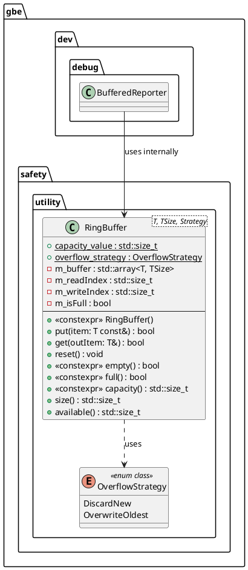

# Code Review Report: `gbe.safety::RingBuffer`

**Reviewer:** Senior Embedded Software Engineer (SIL3 / Functional Safety)
**Datum:** 2026-03-03
**Geprüfte Dateien:** * `lib/elements/gbe.safety/include/gobeyond/safety/utility/ring_buffer.hpp`
* `tests/test_ring_buffer.cpp`

---

## 1. Architektur (Design)

Die `RingBuffer`-Komponente implementiert einen statischen, exceptionsfreien Ringpuffer, der für sicherheitskritische Systeme (SIL3) ausgelegt ist. Die Architektur fügt sich nahtlos in das Papyrus-Gesamtmodell ein, in dem der `BufferedReporter` den Puffer als asynchrones Bindeglied zum `ITransmitter` nutzt.

### Architekturbewertung & Übereinstimmung mit Papyrus Architektur
* **Safety First (No Heap):** Die Verwendung von `std::array` mit Template-Parametern (`TSize`) garantiert, dass der Speicher zur Compile-Zeit berechnet wird und auf dem Stack oder im BSS-Segment liegt. Dynamische Speicherallokationen (Heap) sind ausgeschlossen (Konform zu MISRA / `[ADR-FSM-0035]`).
* **Kapselung:** Die strikte Trennung von Lese- (`m_readIndex`) und Schreibindizes (`m_writeIndex`) ermöglicht eine robuste FIFO-Logik.
* **Strategie-Pattern via Templates:** Das `OverflowStrategy`-Enum wird typsicher und ohne Laufzeit-Overhead als Template-Parameter aufgelöst (`if constexpr`). Dies erfüllt `[REQ-NEW-01]` ohne Interfaces oder virtuelle Methoden (`[REQ-07]`).

### UML-Klassendiagramm (Kontext: Papyrus Architektur)

---

## 2. Befunde & Verstöße (Findings & Violations)

Der Code ist funktional exzellent durchdacht. Die C++17-Features (`if constexpr`, `std::is_trivially_copyable_v`) wurden zielgerichtet eingesetzt. Dennoch gibt es bezüglich der strikten *Coding Guidelines* (`Sprachuntermenge.txt`) und im Bereich der Unit-Tests einige Verstöße:

| ID | Datei | Ort / Zeile | Regel | Beschreibung des Verstoßes | Severity |
| :--- | :--- | :--- | :--- | :--- | :--- |
| **V-01** | `ring_buffer.hpp` | Global | `[ADR-FSM-0005]` | Alle Kommentare im Quelltext sind auf Deutsch verfasst (z.B. `// Schreiben an Schreib-Position`). Die ADR fordert zwingend: "Quelltextkommentare sind in Englisch zu verfassen." | Medium |
| **V-02** | `ring_buffer.hpp` | Zeile 32 | `[ADR-FSM-0018]` | Das Scoped Enum `OverflowStrategy` hat keinen explizit definierten Underlying Type (z.B. `: std::uint8_t`). | Medium |
| **V-03** | `ring_buffer.hpp` | Doxygen | `[ADR-FSM-0036]` | Es fehlen in der Methoden-Dokumentation die zwingend geforderten Tags `@pre` (Vorbedingungen), `@post` (Nachbedingungen) sowie das `@safety`-Tag (aus dem System Prompt). | Low |
| **V-04** | `test_ring_buffer.cpp` | Zeile 38, 48, etc. | `[ADR-FSM-0017]` | Im Testcode wird der Basis-Datentyp `int` für das Template (z.B. `RingBuffer<int, 3>`) und für Variablen (`int val = 123;`) verwendet. Die ADR verbietet die Nutzung von `int` strikt und fordert Fixed Width Integers wie `std::int32_t`. | High |
| **V-05** | `ring_buffer.hpp` | Zeile 105, 137 | Rule 7.0.5 | *Best Practice / Advisory:* Die Addition `(m_writeIndex + 1)` addiert ein signed Literal (`1`) zu einem unsigned `std::size_t`. Dies wird zwar durch *Exception 1* der Rule 7.0.5 gedeckt (da `1` positiv und konstant ist), in sicherheitskritischem Code sollte das Literal jedoch explizit unsigned sein (`1U`), um implizite Promotions vollständig zu vermeiden. | Low |

---

## 3. Verbesserungsvorschläge (Suggestions)

Um vollständige Compliance mit der `Sprachuntermenge.txt` und dem MISRA-Standard herzustellen, müssen folgende Anpassungen vorgenommen werden:

1. **Sprache der Kommentare (`[ADR-FSM-0005]`):**
   Übersetze alle Inline-Kommentare und Doxygen-Blöcke ins Englische. (Bspw.: `/// Lese-Index: Position...` -> `/// Read index: Position of the next element to be read.`).
2. **Explicit Underlying Type für Enum (`[ADR-FSM-0018]`):**
   Ergänze den Typ beim Enum: `enum class OverflowStrategy : std::uint8_t { ... };`.
3. **Doxygen-Ergänzungen (`[ADR-FSM-0036]`):**
   Füge den Funktionen `@pre` und `@post` hinzu. 
   Beispiel für `put()`: 
   * `@pre The type T must be initialized.` 
   * `@post The item is added to the buffer if capacity allows it, or the oldest item is overwritten based on the Strategy.`
   * `@safety Constant time execution O(1), no dynamic memory allocation.`
4. **Vermeidung von Signed-Literalen (MISRA 7.0.5):**
   Ändere `(this->m_writeIndex + 1) % TSize` in `(this->m_writeIndex + 1U) % TSize`. (Ebenso für `m_readIndex`).

---

## 4. Verifikation (Verification - `test_ring_buffer.cpp`)

Die Unit-Tests in `test_ring_buffer.cpp` (Google Test) weisen eine ausgezeichnete Struktur auf und decken auch das deterministische Wrap-Around-Verhalten sowie die Strategien ab `[ADR-FSM-0034]`.

### Positive Befunde
* Boundary Values und logische Extremfälle (Buffer Full, Buffer Empty, Overwrite) sind abgedeckt.
* Die `[[nodiscard]]`-Warnungen wurden durch `EXPECT_TRUE/FALSE` korrekt aufgelöst.
* Tests mit Custom Structs (`Data`) stellen sicher, dass komplexere Datentypen (sofern sie *trivially copyable* sind) verarbeitet werden können.

### Lücken & Vorschläge für die Tests
* **Typ-Korrektur:** Der gravierendste Fehler im Test ist die Verwendung von `int` (`[ADR-FSM-0017]`). **Alle** Vorkommen von `int` müssen durch `std::int32_t` (und `#include <cstdint>`) ersetzt werden.
* **`uint32_t` Namespace:** Das Struct `Data` nutzt `uint32_t id;`. Laut Regelwerk muss der Namespace explizit angegeben werden: `std::uint32_t id;`.
* **Grenzwerte (Zero-Capacity):** Da `TSize > 0` durch ein `static_assert` gefordert wird, sollte ein Compile-Failure-Test (falls das Build-System dies unterstützt) sicherstellen, dass `RingBuffer<std::int32_t, 0>` tatsächlich zur Compile-Zeit fehlschlägt.

---

## 5. Compliance-Zusammenfassung (Compliance Summary)

Die `RingBuffer`-Klasse ist ein exzellentes Beispiel für sicheres Embedded C++ und stellt eine ideale Basis für den `BufferedReporter` dar. Die Speicher- und Ausnahmesicherheit ist zu 100 % gewährleistet. Die Verstöße sind rein formeller Natur (Kommentarsprache, Typ-Aliase im Test).

| Regel-ID | Beschreibung | Status/Begründung |
| :--- | :--- | :--- |
| **[ADR-FSM-0005]** | Englisch für Bezeichner und Kommentare | Offen. Deutsche Kommentare müssen übersetzt werden. |
| **[ADR-FSM-0006/0007]** | Include Guards + `#pragma once` | Eingehalten. `GBE_SAFETY_UTILITY_RING_BUFFER_HPP` ist korrekt definiert. |
| **[ADR-FSM-0013]** | Nutzung von `static_assert` | Eingehalten. Es wird zur Compile-Zeit geprüft, ob `TSize > 0` ist und ob `T` kopierbar ist. |
| **[ADR-FSM-0017]** | Triviale Datentypen / Fixed Width | Offen. Im Testfile wird `int` verwendet, was strengstens verboten ist. |
| **[ADR-FSM-0018]** | Strongly-typed Enums | Offen. Bei `OverflowStrategy` fehlt der Underlying Type. |
| **[ADR-FSM-0024]** | `noexcept` Spezifizierer | Eingehalten. Alle Methoden sind konsequent als `noexcept` deklariert. |
| **[ADR-FSM-0025]** | `[[nodiscard]]` Attribut | Eingehalten. Alle Return-Werte zwingen den Aufrufer zur Fehlerbehandlung. |
| **[ADR-FSM-0027]** | `constexpr` Funktionen | Eingehalten. Getter und Konstruktoren sind `constexpr`. |
| **[ADR-FSM-0036]** | Doxygen / Dokumentation | Offen. `@safety`, `@pre` und `@post` Tags müssen ergänzt werden. |
| **[MISRA Rule 7.0.5]** | Keine sign/unsigned Wechsel bei Promotion | Gedeckt durch Exception 1. Sollte als Best-Practice dennoch auf `1U` umgestellt werden. |
| **[MISRA Rule 11.6.1]** | Initialisierung aller Variablen | Eingehalten. Member Initialization List im Konstruktor initialisiert `m_buffer{}` und alle Indizes komplett. |
